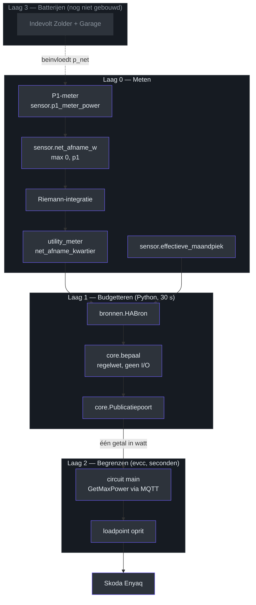
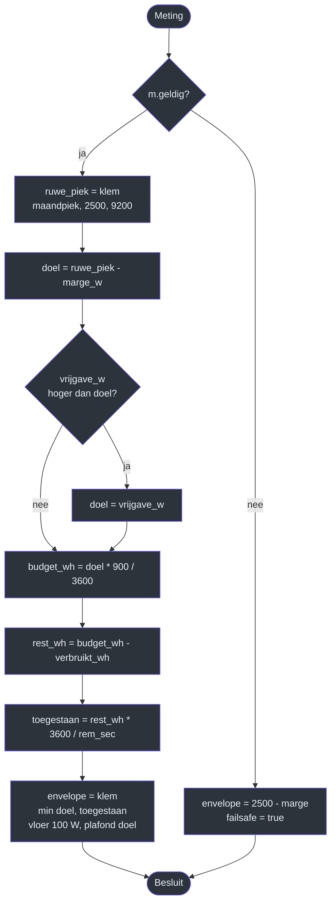
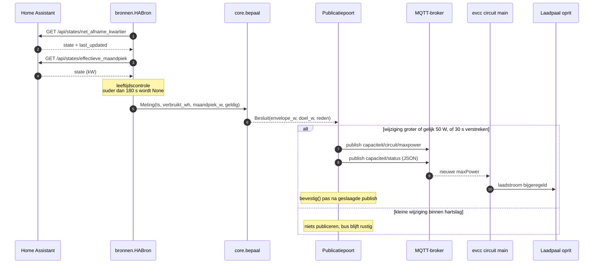
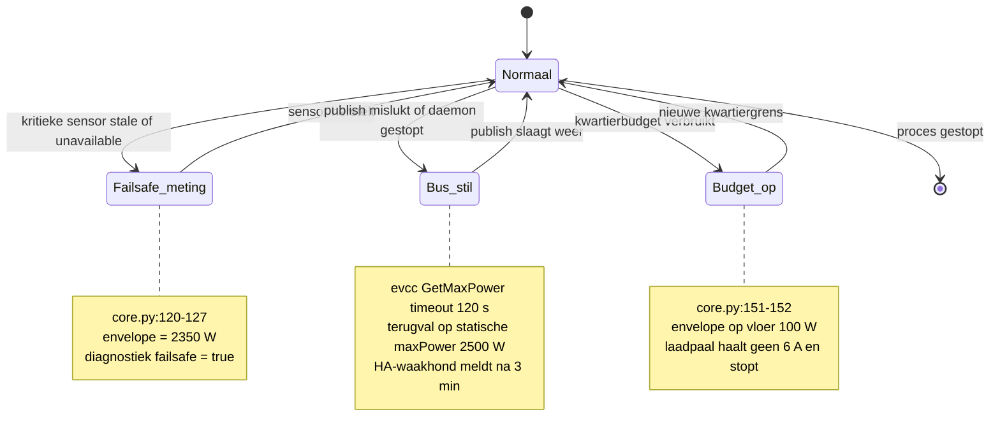

# Capbudget — capaciteitstarief-regeling in vier lagen

## 1. Waarom dit bestaat

Het Belgische capaciteitstarief rekent af op de **hoogste kwartiergemiddelde
netafname van de maand**, met een ondergrens van 2,5 kW. Dat is geen
energietarief maar een vermogenstarief: één ongelukkig kwartier bepaalt de
factuur van de hele maand.

Daaruit volgen twee gevolgtrekkingen die de hele architectuur sturen.

**Inhalen aan het einde van een kwartier levert niets op.** De capaciteits­component
is dan al betaald. Vlak regelen is optimaal, tenzij de auto een deadline heeft.

**Ruimte die je al gekocht hebt, is gratis.** Heeft de oven deze maand één keer
4,2 kW gepiekt, dan kost laden tot 4,2 kW voor de rest van de maand niets extra.
Een regelaar die het hele maand vasthoudt aan 2,5 kW laadt de helft van de maand
onnodig traag. De regelwet neemt daarom `max(maandpiek, 2500)` als doel
(`core.py:130`), niet een vaste drempel.

### Wat de vorige generatie fout deed

| Probleem | Oorzaak | Oplossing in deze opzet |
|---|---|---|
| Kon aan het begin van de maand 2,5 kW niet halen | Marge tweemaal multiplicatief toegepast | Eén absolute marge van 150 W (`core.py:26`, veld `marge_w`) |
| Ampèreklim vlak voor de kwartiergrens | `rest / resterende_tijd` is hyperbolisch | `min()` met het doel als plafond (`core.py:145`) |
| Freeze window, stapgrenzen, noodrem | HA was de snelle regelaar | Snelle regeling verhuisd naar evcc (laag 2) |

Die derde regel is de kern van de herziening: freeze windows en stapgrenzen
waren **symptoombestrijding voor een verkeerde laagindeling**. Zodra de snelle
regeling bij evcc ligt, zijn ze overbodig en verdwijnen ze uit de code.

---

## 2. Architectuur

Vier lagen, elk met één verantwoordelijkheid en één uitvoerformaat. Geen laag
mag de laag eronder overslaan.



### Contracten tussen de lagen

| Grens | Formaat | Bewijs |
|---|---|---|
| Laag 0 → 1 | HA REST `/api/states/{entity}` | `bronnen.py:58`, `haal_state()` |
| Laag 1 → 2 | MQTT-topic, één integer in watt | `daemon.py:41`, `publiceer()` |
| Laag 2 → hardware | evcc-interne regeling | buiten deze repo |

Het belangrijkste wat **niet** in de contracten staat: laag 1 kent geen ampère,
geen fasen en geen laadpaal. De uitvoer van `bepaal()` is `envelope_w`, een
integer (`core.py:80`, dataclass `Besluit`). Daarmee is `select.evcc_oprit_max_current`
volledig uit het besturingspad verdwenen.

> **Waarom dat telt.** Twee schrijvers op hetzelfde actuatiepad — een
> HA-automatisering én een evcc-circuitlimiet — regelen tegen elkaar in. Dat is
> de foutklasse waar de vorige generatie aan leed. Eén schrijver, één topic.

---

## 3. De regelwet

De volledige beslislogica staat in `core.bepaal()` (`core.py:106`) en is
bewust vrij van I/O: geen netwerk, geen klok, geen toestand. Alleen een
`Meting` erin (`core.py:53`) en een `Besluit` eruit.



In pseudocode, met de regels waar het echt om draait:

```python
doel      = clamp(maandpiek_w, 2500, 9200) - marge_w   # core.py:130-131
budget_wh = doel * 900 / 3600                          # core.py:139
rest_wh   = budget_wh - kwartier_verbruikt_wh          # core.py:140
rem_sec   = max(900 - (ts % 900), 1.0)                 # core.py:141, :90
envelope  = clamp(min(doel, rest_wh * 3600 / rem_sec), # core.py:142, :145
                  vloer_w, doel)
```

### Waarom `min()` de hyperbolische klim doodt

`rest_wh * 3600 / rem_sec` is het gemiddelde vermogen dat je nog zou mógen
trekken. Naarmate `rem_sec` naar nul loopt, schiet die term naar oneindig zodra
je onder budget zit. In de vorige generatie was dát de gestuurde waarde, met
een ampèreklim vlak voor de kwartiergrens als gevolg.

Hier is het slechts één van twee argumenten van een `min()` (`core.py:145`).
De term mag omhoog schieten zoveel hij wil; hij komt nooit door het plafond.
Correctie is dus **alleen neerwaarts** — precies de eigenschap die
`tests/test_core.py`, `test_geen_hyperbolische_klim` afdwingt voor
resterende tijden van 600 tot 1 seconde.

### Redenen in het besluit

`bepaal()` geeft naast het getal ook een reden terug (`core.py:147-156`), die
in de MQTT-status en het HA-dashboard belandt:

| Reden | Voorwaarde |
|---|---|
| `vlak op doel` | onder budget, envelope gelijk aan doel |
| `voorlopend op budget — envelope verlaagd` | `toegestaan < doel` |
| `kwartierbudget op — laden onderbroken` | envelope op de vloer van 100 W |
| `vrijgave actief` | bewust duurdere piek geaccepteerd |
| `meting ongeldig` | kritieke sensor stale of unavailable |

---

## 4. Dataflow: één tik van de budgetteur

`Loop.tik()` (`daemon.py:66`) draait standaard elke 30 s
(`bronnen.py:24`, veld `interval_sec`).



De volgorde in stap 12 is niet toevallig: `Publicatiepoort.bevestig()`
(`core.py:197`) wordt pas aangeroepen nádat `publiceer()` succes meldt
(`daemon.py:75-79`). Mislukt de publicatie, dan blijft de poort open en
probeert de volgende tik het opnieuw — anders zou een mislukte publish stilletjes
als geslaagd worden geboekt en zou de hartslag alsnog verlopen.

### De publicatiepoort

Het enige stukje toestand in laag 1 (`core.py:178`), bewust gescheiden van de
regelwet:

| Regel | Gedrag | Bewijs |
|---|---|---|
| Eerste besluit | altijd publiceren | `core.py:191-192` |
| Verschil ≥ 50 W | direct publiceren | `core.py:193-194` |
| Anders | pas na 30 s hartslag | `core.py:195` |

De hartslag is geen optimalisatie maar een **veiligheidsvereiste**: evcc's
`GetMaxPower` heeft een timeout van 120 s. Publiceert de daemon niet binnen dat
venster, dan valt evcc terug op de statische `maxPower`. `hartslag_sec` moet
dus ruim onder die timeout blijven.

---

## 5. Failsafe-gedrag

Er zijn drie manieren waarop deze keten kan falen, en elke laag vangt zijn eigen
geval op.



Drie ontwerpkeuzes hierin verdienen toelichting:

**MQTT-berichten zijn niet retained** (`daemon.py:41-45`). Een retained envelope
blijft na een crash op de broker staan en zou precies de terugval ondermijnen
die we willen. Zonder retain verloopt de waarde en zakt evcc naar 2500 W.

**Alleen twee sensoren zijn kritiek.** `lees_meting()` (`bronnen.py:104`) zet
`geldig=False` uitsluitend als het kwartierverbruik óf de maandpiek ontbreekt.
Valt `p1_meter_power` of het laadvermogen weg, dan draait de regeling door —
die twee zijn diagnostiek en worden nergens in `bepaal()` gebruikt.

**De hoofdlus mag nooit sterven** (`daemon.py:89-92`): een brede `except` rond
`tik()`, want een niet-afgevangen uitzondering betekent een stilgevallen
budgetteur en dus 2500 W voor de rest van de nacht.

---

## 6. De meetlaag in Home Assistant

Het HA-package (`ha/capbudget.yaml`) regelt niets; het levert de meetlaag en de
ontsnappingsklep.

| Entiteit | Rol | Regel |
|---|---|---|
| `sensor.net_afname_w` | `max(0, p1)` — injectie mag het budget niet verlagen | `ha/capbudget.yaml:30` |
| `sensor.net_afname_energie` | Riemann-integratie | `ha/capbudget.yaml:60` |
| `sensor.net_afname_kwartier` | `utility_meter`, cyclus `quarter-hourly` | `ha/capbudget.yaml:71` |
| `input_number.cap_vrijgave_w` | ontsnappingsklep, 0 = uit | `ha/capbudget.yaml:10` |
| `sensor.cap_envelope` | wat de daemon publiceerde, terug in HA | `ha/capbudget.yaml:48` |
| Waakhond | meldt als de envelope 3 min stilstaat | `ha/capbudget.yaml:80` |

De `max(0, p1)`-stap is niet cosmetisch. Zonder die klem zou zonne-injectie het
kwartierverbruik verlagen en zou de regelaar denken dat er budget over is dat er
niet is — het capaciteitstarief kijkt uitsluitend naar afname.

---

## 7. Validatie zonder productie

Het duurste onderdeel van de vorige generatie was niet het schrijven maar het
**testen**: elke hypothese kostte een kwartier wachten, elke regressie een maand.
Daarom is `bepaal()` vrij van I/O — de replay-harness voert exact dezelfde
functie.

```mermaid
graph LR
    subgraph OPN["Opname"]
        LOG[logger.py<br>elke 2 s]
        CSV[(CSV per dag<br>10 kolommen)]
        LOG --> CSV
    end

    subgraph REP["Replay"]
        LEES[replay.lees_regels]
        HUIS["huishouden = p_net - p_ev<br>echt gemeten"]
        KERN[core.bepaal<br>dezelfde functie]
        MODEL[replay.Laadmodel<br>benadering]
        BOEK[replay.Boekhouding]
        LEES --> HUIS --> KERN --> MODEL --> BOEK
    end

    subgraph UIT["Uitkomst"]
        RES[hoogste kwartierpiek<br>geladen kWh<br>envelope-wijzigingen]
    end

    CSV --> LEES
    BOEK --> RES
    MODEL -->|"terugkoppeling p_ev"| HUIS

    style LOG fill:#2d333b,stroke:#6d5dfc,color:#e6edf3
    style CSV fill:#2d333b,stroke:#6d5dfc,color:#e6edf3
    style LEES fill:#2d333b,stroke:#6d5dfc,color:#e6edf3
    style HUIS fill:#2d333b,stroke:#6d5dfc,color:#e6edf3
    style KERN fill:#2d333b,stroke:#6d5dfc,color:#e6edf3
    style MODEL fill:#2d333b,stroke:#6d5dfc,color:#e6edf3
    style BOEK fill:#2d333b,stroke:#6d5dfc,color:#e6edf3
    style RES fill:#2d333b,stroke:#6d5dfc,color:#e6edf3
    style OPN fill:#161b22,stroke:#30363d,color:#e6edf3
    style REP fill:#161b22,stroke:#30363d,color:#e6edf3
    style UIT fill:#161b22,stroke:#30363d,color:#e6edf3
```



### Wat feit is en wat model

**Feit** (uit de log): het huishoudelijk verbruik, berekend als `p_net - p_ev`
(`replay.py:208`). Dat is het werkelijke restvermogen aan de meter, inclusief
zon en batterij.

**Model** (benadering, expliciet gemarkeerd): de reactie van auto en evcc.
`Laadmodel.volgende()` (`replay.py:49`) klemt op minimum 6 A, maximum 32 A en
een helling van 300 W/s. Die parameters zijn plausibele aannames, geen
gemeten waarden — *(Onbekend — te verifiëren tegen de eerste echte logs)*.

De harness is dus geschikt om regelwetten te **vergelijken**, niet om absolute
kWh te voorspellen.

### Bekende vertekening

De simulatie evalueert elk sample (elke 2 s), terwijl de daemon elke 30 s draait
met een drempel van 50 W. Het gerapporteerde aantal envelope-wijzigingen is
daarmee een **bovengrens**, niet de werkelijke buslast.

### Uitkomst op synthetische data

Twee uur, huishouden met oven- en waterkokerpiek, auto ongeregeld op 3,68 kW:

| Metriek | Gemeten | Gesimuleerd |
|---|---|---|
| Hoogste kwartierpiek | 5699 W | 2478 W |
| Geladen | 6,74 kWh | 3,25 kWh |

Dat gesimuleerde kwartier van 2478 W ligt **boven** het doel van 2350 W. Het is
het ovenkwartier: het huishouden alleen at de envelope al op en de auto kon niet
ver genoeg terug. Dit is geen bug in de regelwet maar precies het geval waarvoor
laag 3 bestaat — een snelle batterijshaver op secondeschaal.

---

## 8. Testdekking

25 tests, alleen stdlib (`python3 -m unittest discover -s tests`).

| Testklasse | Bewaakt | Bestand |
|---|---|---|
| `TestDoelbepaling` | maandpiek geeft gratis ruimte; absurde piek geklemd | `tests/test_core.py` |
| `TestPlafondOnly` | geen hyperbolische klim; monotone daling | `tests/test_core.py` |
| `TestRandgevallen` | failsafe, vrijgave, geen auto | `tests/test_core.py` |
| `TestPublicatiepoort` | hartslag dwingt publicatie af | `tests/test_core.py` |
| `TestLaadmodel` | onder 6 A is uit; slew begrenst | `tests/test_replay.py` |
| `TestBoekhouding` | injectie telt niet mee; afgekapt kwartier geen piek |`tests/test_replay.py` |

De belangrijkste is `test_geen_hyperbolische_klim`: een expliciete regressietest
op de fout uit de vorige generatie, over zeven resterende tijden.

---

## 9. Uitrolvolgorde

De volgorde is bewust conservatief. Stap 3 wordt het snelst overgeslagen en is
het belangrijkst.

| Stap | Actie | Duur | Regelt iets? |
|---|---|---|---|
| 1 | Package plaatsen, `logger.py` draaien | 1 week | nee |
| 2 | `replay.py` over de logs | uren | nee |
| 3 | v8 uit, evcc-circuit statisch 2500 W | 1 week | evcc |
| 4 | `daemon.py` aan via MQTT | — | ja |
| 5 | Batterijbeslissing op basis van stap 3 | — | later |

Er is een reële kans dat een statische circuitlimiet in stap 3 al 80% van het
resultaat levert. Dan bouw je laag 1 alleen nog voor de laatste 20% — en weet je
dat vooraf in plaats van achteraf. *(Inferentie, te toetsen met de meting uit
stap 3.)*

### evcc-configuratie (laag 2)

```yaml
circuits:
  - name: main
    title: "hoofdcircuit"
    maxPower: 2500          # statische failsafe
    GetMaxPower:
      source: mqtt
      topic: capaciteit/circuit/maxpower
      timeout: 120s
    meter: grid

site:
  circuit: main
loadpoints:
  - title: oprit
    circuit: main
```

---

## 10. Openstaand: laag 3

De batterijvraag is bewust uitgesteld tot na de meting van stap 3. Met een
circuitlimiet op de netmeter ontstaat een risico dat de vorige generatie niet had:
evcc duwt de laadstroom omhoog tot het net de limiet raakt, waarna de batterijen
in zelfconsumptie het gat vullen — de batterij loopt de auto in.

| Optie | Werking | Nadeel |
|---|---|---|
| A — vrij shaven | `batteryDischargeControl: false`, SoC-reserve op de Indevolts | batterij kan leeglopen in de auto |
| B — vastzetten | MQTT `batteryMode: hold` tijdens laden | shaveert dan ook geen kookpieken |

De verwachting is dat een tijdsplitsing nodig is: `hold` bij PV-overschot,
`normal` in de avondpiek. *(Hypothese, geen conclusie — de meting beslist.)*

---

## 11. Referenties

| Bestand | Inhoud |
|---|---|
| `core.py` | regelwet, `Meting`, `Besluit`, `Publicatiepoort` — geen I/O |
| `bronnen.py` | `Config`, `HABron`, leeftijdscontrole, `LOG_KOLOMMEN` |
| `daemon.py` | `MQTTUitgang`, `Loop.tik()`, `Loop.run()` |
| `logger.py` | `CSVSchrijver` met dagrotatie, `LoggerLoop` |
| `replay.py` | `Laadmodel`, `Kwartier`, `Boekhouding`, `simuleer()` |
| `ha/capbudget.yaml` | meetlaag, vrijgaveknop, envelope-sensor, waakhond |
| `tests/` | 25 tests, stdlib only |

### Sleutelconstanten

| Naam | Waarde | Plaats |
|---|---|---|
| `KWARTIER_SEC` | 900,0 | `core.py:18` |
| `ONDERGRENS_W` | 2500,0 | `core.py:19` |
| `marge_w` | 150,0 W | `core.py:26` |
| `piek_bovengrens_w` | 9200,0 W | `core.py:26` |
| `envelope_vloer_w` | 100,0 W | `core.py:26` |
| `publicatie_drempel_w` | 50,0 W | `core.py:26` |
| `hartslag_sec` | 30,0 s | `core.py:26` |
| `max_leeftijd_sec` | 180,0 s | `bronnen.py:24` |
